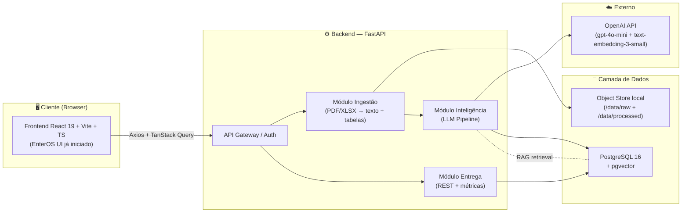
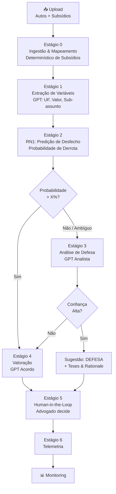
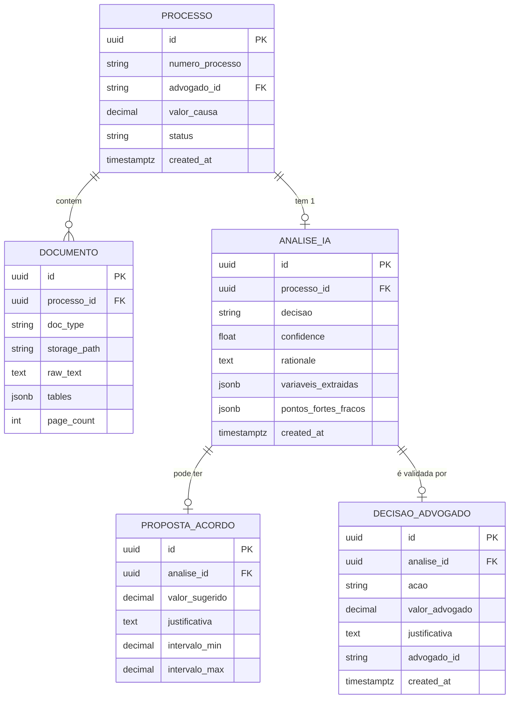

# DEVELOPMENT_CONTEXT.md

> **Single Source of Truth — Hackathon UFMG 2026 / Enter AI Challenge**
> Projeto: **EnterOS — Política de Acordos Inteligente (Banco UFMG)**
> Versão: `1.0.0` · Status: `MASTER PLAN — LOCKED`
> Audiência: humanos do squad **e** agentes de IA (Claude, Gemini, Cursor, Copilot, etc.)
> Janela de execução: **17/04 (briefing) → 18/04 04:00 (submissão)** — 22 a 24h úteis.

---

## 0. Como ler este documento

1. **Humanos**: leiam as Seções 1–4 e a sua célula em §11. Releiam §12 antes de cada PR.
2. **Agentes de IA**: a Seção §12 (`AI Directives`) é **prescritiva e não-negociável**. Antes de qualquer geração de código, releiam §6 (contratos de dados) e §7 (estrutura de pastas). Se um requisito do usuário **conflitar** com este documento, **pare e peça desambiguação** — não improvise.
3. Toda decisão técnica que **divergir** deste documento exige um ADR de uma página em `docs/adr/NNN-titulo.md` antes do merge.

---

## 1. Recap do Problema (sem ruído)

O Banco UFMG recebe ~5k processos/mês alegando **não reconhecimento de contratação de empréstimo**. Para cada processo, um advogado externo precisa decidir, à luz dos **Autos** (petição inicial + procuração) e dos **Subsídios** (contrato, extrato, comprovante de crédito, dossiê, demonstrativo de evolução da dívida, laudo referenciado), entre **DEFENDER** ou **PROPOR ACORDO** — e, neste segundo caso, qual valor oferecer.

Hoje a decisão é heterogênea, lenta, e o banco não consegue medir aderência nem efetividade da política.

**Os 5 requisitos obrigatórios da banca** (não negociáveis):

| # | Requisito | Onde mora na nossa solução |
|---|---|---|
| 1 | Regra de decisão (acordo vs defesa) | Pipeline Híbrido (Estágio 2: RN1 + Estágio 3: GPT Analista) |
| 2 | Sugestão de valor de acordo | Pipeline IA — Estágio 4 (GPT Acordo) |
| 3 | Acesso prático do advogado à recomendação | Frontend — `Decision Lab` (já existe) + HITL |
| 4 | Monitoramento de **aderência** (advogado seguiu?) | Frontend — `Monitoring` + tabela `decisao_advogado` |
| 5 | Monitoramento de **efetividade** (política funciona?) | Frontend — `Monitoring` + agregação sobre `resultado_final` |

> **Critério de sucesso na banca**: clareza de leitura do problema, qualidade da UX do advogado, uso de IA como diferencial e demo executável end-to-end. **Não tente entregar tudo. Entregue o caminho dourado.**

---

## 2. Visão de Produto (Caminho Dourado)

> "Em **menos de 60 segundos** após anexar Autos + Subsídios de um processo, o advogado vê a recomendação fundamentada (acordo/defesa), o valor sugerido com intervalo de confiança, os trechos exatos dos documentos que sustentam a decisão, e pode aprovar/ajustar/recusar com um clique. O banco vê, em tempo real, aderência e efetividade no `Monitoring`."

**Demo de 2 minutos** (gravar até T+22h):

1. **0:00–0:20** — Login como advogado, abrir um caso novo no `Evidence Hub`, drag-and-drop de Autos + 6 subsídios.
2. **0:20–0:50** — Pipeline roda com loading real (não fake `64%`); chega ao `Decision Lab`.
3. **0:50–1:30** — Tour pelo `Decision Lab`: recomendação, valor, justificativa citando documentos, custo de litigar, botões `Aceitar / Ajustar / Defender`.
4. **1:30–2:00** — Pula para `Monitoring` (perfil banco): aderência por advogado, economia acumulada, casos de alto risco.

---

## 3. Arquitetura do Sistema

### 3.1 Visão de alto nível



### 3.2 Decisões arquiteturais (ADRs implícitos)

| Decisão | Escolha | Motivo |
|---|---|---|
| Backend | **Python 3.11 + FastAPI** | OpenAI SDK nativo, ecosistema melhor para PDF/CSV (pypdf, pdfplumber, pandas), Pydantic ↔ TS interfaces |
| Banco | **PostgreSQL 16 + extensão `pgvector`** | Um único banco para dados transacionais E embeddings. Evita o overhead operacional de ChromaDB/Pinecone num hackathon |
| LLM | **OpenAI `gpt-4o-mini`** (raciocínio) + **`text-embedding-3-small`** (RAG) | Crédito fornecido pela banca, latência baixa, custo previsível, qualidade suficiente para o domínio |
| Front | **Mantém React 19 + Vite + TS já existente.** Adicionar `axios` + `@tanstack/react-query` + `zod` | Não reescrever o que está bonito — só conectar ao backend |
| Orquestração | **Docker + docker-compose** | Mandatório pelo briefing interno; garante reprodutibilidade na avaliação |
| Auth | **JWT mock simples** (1 usuário advogado + 1 banco) | Hackathon — segurança real fora de escopo |

### 3.3 Pipeline modular



---

## 4. Pipeline de IA — Detalhamento (o coração do projeto)

### 4.1 Estágio 0 — Ingestão & Verificação Determinística

**Responsabilidade**: transformar bytes brutos em texto e verificar a presença de documentos obrigatórios via código (não via LLM).

- **Ingestão**: PDFs/XLSX processados via `pdfplumber` / `openpyxl`.
- **Mapeamento Determinístico**: O sistema verifica obrigatoriamente a presença de: `CONTRATO`, `EXTRATO`, `COMPROVANTE_CREDITO`, `DOSSIE`, `DEMONSTRATIVO_DIVIDA`, `LAUDO_REFERENCIADO`.
- Saída: Objeto `IngestedDocument` + Dicionário de Booleanos dos subsídios.

### 4.2 Estágio 1 — Extração de Variáveis (LLM)

Usar **GPT-4o-mini** para extrair as variáveis contextuais do processo:

```json
{
  "uf": "MG",
  "valor_causa": 15000.00,
  "sub_assunto": "golpe | generico",
  "trechos_chave": [
    {"doc": "peticao_inicial", "page": 3, "quote": "..."}
  ]
}
```

### 4.3 Estágio 2 — Probabilidade RN1 (Rede Neural)

A Rede Neural **RN1** recebe como entrada os dados extraídos e os subsídios mapeados:
- **Inputs**: UF, Valor da Causa, Sub-assunto, Booleanos dos 6 Subsídios.
- **Lógica**: A RN estima a probabilidade de "Não Êxito" (derrota do banco).
- **Threshold (X)**: Se `probabilidade_derrota > X%`, o caso é considerado perdido e segue para o Estágio 4 (Acordo). Se for menor, segue para o Estágio 3 (Análise de Ambiguidade).

### 4.4 Estágio 3 — Análise de Defesa (GPT Analista)

Para casos ambíguos, um GPT atua como analista jurídico sênior:
- **Tarefa**: Identificar pontos positivos da defesa e falhas/pontos fracos.
- **Output**:
  - Lista de pontos fortes/fracos.
  - **Score de Confiança**: Se for baixo, recomenda-se Acordo. Se for alto, recomenda-se Defesa com fundamentação.

### 4.5 Estágio 4 — Valoração (GPT Acordo)

Casos destinados ao acordo são processados pelo **GPT Acordo**:
- **Tarefa**: Estimar um valor de acordo justo e fundamentado.
- **Contexto**: Recebe os documentos, as variáveis do caso e os pontos positivos/negativos levantados no estágio anterior.
- **Output**:
  - `valor_acordo`: Valor sugerido em BRL.
  - `justificativa`: O "porquê" do valor (fundamentação técnica).

### 4.6 Estágio 5 — Human-in-the-Loop (HITL)

Interface `Decision Lab` onde o advogado valida ou ajusta a recomendação. Toda ação alimenta a tabela `decisao_advogado` para cálculo de aderência.

---

## 5. Stack & Estrutura de Pastas

### 5.1 Stack consolidada

| Camada | Tecnologia | Versão fixa |
|---|---|---|
| Frontend | React + Vite + TypeScript + react-router-dom + axios + @tanstack/react-query + zod | 19 / 6 / 5.8 / 7 / 1.7 / 5.59 / 3.23 |
| Backend | FastAPI + Pydantic v2 + SQLAlchemy 2 + Alembic + Uvicorn | 0.115 / 2.9 / 2.0 / 1.13 / 0.32 |
| AI | `openai` SDK + `tiktoken` | 1.54 / 0.8 |
| Ingestão | `pdfplumber` + `pytesseract` + `openpyxl` + `pandas` | 0.11 / 0.3 / 3.1 / 2.2 |
| Banco | PostgreSQL + pgvector | 16 / 0.7 |
| DevOps | Docker + docker-compose | 27 / v2 |
| Testes | `pytest` + `httpx` (back); `vitest` + `@testing-library/react` (front) | 8 / 0.27; 2 / 16 |

### 5.2 Estrutura de pastas (raiz do repositório)

```
hackathon-ufmg-2026-grupo<N>/
├── README.md
├── SETUP.md
├── DEVELOPMENT_CONTEXT.md     ← este documento
├── docker-compose.yml
├── .env.example
├── .gitignore
│
├── docs/
│   ├── presentation.pdf
│   ├── policy.md              ← política de acordos em linguagem jurídica
│   ├── adr/                   ← Architecture Decision Records
│   └── api.md                 ← link para /docs do FastAPI
│
├── data/                      ← gitignored (dados sensíveis da banca)
│   ├── sentencas.csv
│   ├── subsidios/
│   └── processos_exemplo/
│
└── src/
    ├── front/                 ← já existe — NÃO recriar
    │   ├── package.json
    │   ├── vite.config.ts
    │   └── src/
    │       ├── api/           ← NOVO — clientes axios + hooks TanStack
    │       │   ├── client.ts
    │       │   ├── processes.ts
    │       │   └── metrics.ts
    │       ├── screens/       ← já existe
    │       ├── modules/
    │       └── data.ts        ← virá VAZIO de mocks ao final
    │
    └── back/
        ├── pyproject.toml
        ├── Dockerfile
        ├── alembic.ini
        ├── alembic/
        │   └── versions/
        ├── policy.yaml        ← parâmetros editáveis pelo time jurídico
        └── app/
            ├── main.py        ← FastAPI app + CORS + routers
            ├── config.py      ← pydantic-settings, lê .env
            ├── deps.py        ← DI (db session, current_user)
            ├── core/
            │   ├── security.py
            │   └── logging.py
            ├── db/
            │   ├── base.py
            │   ├── session.py
            │   └── models/
            │       ├── processo.py
            │       ├── documento.py
            │       ├── analise_ia.py
            │       ├── proposta_acordo.py
            │       └── decisao_advogado.py
            ├── schemas/        ← Pydantic — espelha §6
            ├── routers/
            │   ├── auth.py
            │   ├── processes.py
            │   ├── analysis.py
            │   └── metrics.py
            ├── services/
            │   ├── ingestion/
            │   │   ├── pdf.py
            │   │   ├── xlsx.py
            │   │   └── ocr.py
            │   ├── ai/
            │   │   ├── prompts/        ← .md por estágio, versionados
            │   │   ├── extractor.py
            │   │   ├── classifier.py
            │   │   ├── valuator.py
            │   │   └── retriever.py    ← RAG via pgvector
            │   └── metrics/
            │       └── aggregator.py
            └── tests/
                ├── unit/
                ├── integration/
                └── prompts/             ← evals do Dev 5
```

---

## 6. Esquema de Dados (Postgres) & Contratos (Pydantic/TS)

### 6.1 ER simplificado



### 6.2 Contratos compartilhados

**Regra de ouro**: o Pydantic é a fonte. O Dev 3 gera TS via `openapi-typescript` apontando para `/openapi.json`. **Nada de redigitar interfaces.**

```python
# src/back/app/schemas/analysis.py
from pydantic import BaseModel, Field
from decimal import Decimal
from enum import Enum
from uuid import UUID

class Decisao(str, Enum):
    ACORDO = "ACORDO"
    DEFESA = "DEFESA"

class TrechoChave(BaseModel):
    doc: str
    page: int
    quote: str = Field(..., max_length=500)

class AnaliseIAResponse(BaseModel):
    id: UUID
    processo_id: UUID
    decisao: Decisao
    confidence: float = Field(..., ge=0.0, le=1.0)
    rationale: str
    pontos_fortes: list[str]
    pontos_fracos: list[str]
    requires_supervisor: bool
    proposta: "PropostaAcordoResponse | None" = None
    trechos_chave: list[TrechoChave]

class PropostaAcordoResponse(BaseModel):
    valor_sugerido: Decimal
    justificativa: str
    intervalo_min: Decimal
    intervalo_max: Decimal
```

---

## 7. API — Endpoints obrigatórios

| Método | Rota | Descrição | Status MVP |
|---|---|---|---|
| `POST` | `/auth/login` | Login mock, retorna JWT | M1 |
| `POST` | `/processes` | Cria processo + faz upload multipart de N documentos | M1 |
| `GET` | `/processes/{id}` | Detalhes do processo + documentos extraídos | M1 |
| `POST` | `/processes/{id}/analyze` | Dispara pipeline IA (síncrono no MVP, com `BackgroundTasks` se sobrar tempo) | M2 |
| `GET` | `/processes/{id}/analysis` | Retorna `AnaliseIAResponse` completa | M2 |
| `POST` | `/analysis/{id}/decision` | Advogado registra `ACEITAR / AJUSTAR / RECUSAR` | M2 |
| `GET` | `/dashboard/metrics` | Métricas agregadas para o `Monitoring` | M3 |
| `GET` | `/dashboard/recommendations` | Lista de recomendações recentes (para o feed) | M3 |
| `GET` | `/health` | Liveness probe | M1 |
| `GET` | `/docs` | Swagger UI (FastAPI nativo) | M1 |

> Toda resposta de erro segue [RFC 7807](https://datatracker.ietf.org/doc/html/rfc7807) (`application/problem+json`). Erros de parsing de documento retornam `422` com `errors[].doc_name` e `errors[].reason`.

---

## 8. Docker — `docker-compose.yml` (versão MVP)

```yaml
# docker-compose.yml
services:
  db:
    image: pgvector/pgvector:pg16
    environment:
      POSTGRES_USER: enteros
      POSTGRES_PASSWORD: ${POSTGRES_PASSWORD:-enteros_dev}
      POSTGRES_DB: enteros
    ports: ["5432:5432"]
    volumes:
      - pgdata:/var/lib/postgresql/data
    healthcheck:
      test: ["CMD-SHELL", "pg_isready -U enteros"]
      interval: 5s
      retries: 10

  back:
    build: ./src/back
    env_file: .env
    depends_on:
      db: { condition: service_healthy }
    ports: ["8000:8000"]
    volumes:
      - ./src/back:/app
      - ./data:/data:ro
    command: >
      sh -c "alembic upgrade head &&
             uvicorn app.main:app --host 0.0.0.0 --port 8000 --reload"

  front:
    build: ./src/front
    depends_on: [back]
    ports: ["5173:5173"]
    environment:
      VITE_API_BASE_URL: http://localhost:8000
    volumes:
      - ./src/front:/app
      - /app/node_modules
    command: npm run dev -- --host 0.0.0.0

volumes:
  pgdata:
```

`.env.example` (Dev 4 mantém atualizado):

```bash
OPENAI_API_KEY=sk-...           # fornecido pela banca
OPENAI_MODEL_REASONING=gpt-4o-mini
OPENAI_MODEL_EMBEDDING=text-embedding-3-small
POSTGRES_PASSWORD=enteros_dev
JWT_SECRET=change-me-only-for-demo
DATABASE_URL=postgresql+psycopg://enteros:enteros_dev@db:5432/enteros
LOG_LEVEL=INFO
```

---

## 9. Ingestão Inicial dos Dados da Banca (script único)

Um script `src/back/scripts/seed_sentencas.py` precisa rodar **uma vez** para popular `sentenca_historica` e gerar embeddings das 60k sentenças. Sem isso, o RAG não funciona.

- Usa `text-embedding-3-small` em batches de 100.
- Custo estimado: ~60k × 50 tokens × $0.02/1M = **<$0.10**. Seguro.
- Idempotente: checa `count()` antes de rodar.
- Roda automaticamente no `entrypoint.sh` do container `back` na primeira subida (Dev 4 implementa).

---

## 10. Política de Acordos — `policy.yaml`

```yaml
# src/back/policy.yaml
version: "1.0"
last_reviewed_by: "time juridico"

confidence_thresholds:
  green: 0.85
  yellow: 0.60

settlement_bounds:
  piso_pct_valor_causa: 0.30
  teto_pct_valor_causa: 0.70
  piso_absoluto_brl: 1500.00
  teto_absoluto_brl: 50000.00

documental_completeness_penalty:
  contrato_ausente: -0.20
  comprovante_credito_ausente: -0.15
  dossie_ausente: -0.05

red_flags_forcing_defense:
  - "assinatura_evidentemente_falsificada_no_dossie"
  - "ausencia_total_de_comprovante_de_credito"
```

> Esse arquivo é **lido pela API a cada request** (não cacheado). Permite que o jurídico calibre sem deploy. **Mostre isso na apresentação** — pontua em "criatividade".

---

## 11. Plano de Execução — Squad de 5 (timeline em horas)

> Hora zero (`T+0`) = início do squad sprint após este documento ser aprovado.

### 11.1 Responsabilidades (DRI = Directly Responsible Individual)

| Dev | Cargo | Stack primária | DRI por |
|---|---|---|---|
| **Dev 1** | AI / Data Science | Python, OpenAI, pandas, pgvector | `services/ai/*`, prompts, evals, RAG, `seed_sentencas.py` |
| **Dev 2** | Backend / API | FastAPI, SQLAlchemy, Alembic | `routers/*`, `db/models/*`, `schemas/*`, migrations |
| **Dev 3** | Frontend / UX | React 19, TanStack Query, axios | `src/front/src/api/*`, conectar telas, HITL UI no `Decision Lab` |
| **Dev 4** | DevOps / Integração | Docker, GitHub Actions, glue | `docker-compose.yml`, `.env`, ingestão de subsídios, CI smoke test |
| **Dev 5** | QA / Prompt Engineer / Pitch | pytest, evals, slides | Testes nos 2 processos exemplo, eval de prompts em slice de 200 sentenças, **vídeo de 2min**, slides |

### 11.2 Milestones e gates

```mermaid
gantt
    title Sprint Hackathon UFMG 2026 (T+0 = kickoff, T+22h = freeze)
    dateFormat  HH:mm
    axisFormat %Hh

    section M1 — MVP de Ingestão
    Setup repo + docker-compose       :a1, 00:00, 1h
    Models + migrations + auth mock   :a2, after a1, 2h
    Endpoint upload + ingestão PDF    :a3, after a2, 3h
    Front conecta upload (sem IA)     :a4, after a2, 3h
    GATE M1 (upload→DB funcionando)   :milestone, after a4, 0h

    section M2 — Pipeline IA Funcional
    seed_sentencas + RAG retriever    :b1, 06:00, 2h
    Prompts E1 + E2 (extracao/class)  :b2, 06:00, 3h
    Valuator + policy.yaml            :b3, after b2, 2h
    Endpoint /analyze + /decision     :b4, after b3, 2h
    Front: Decision Lab dinâmico+HITL :b5, after b2, 4h
    GATE M2 (2 cases exemplo passam)  :milestone, after b5, 0h

    section M3 — Dashboards & Polish
    /dashboard/metrics + agregações   :c1, 14:00, 2h
    Monitoring conectado a métricas   :c2, after c1, 2h
    Evals em 200 sentenças (Dev 5)    :c3, 14:00, 3h
    Gravar vídeo 2min (Dev 5)         :c4, 18:00, 2h
    Slides 15min                      :c5, after c4, 2h
    Smoke test full em VM limpa       :c6, 21:00, 1h
    GATE M3 — FREEZE                  :milestone, 22:00, 0h

    section Buffer
    Bugfixes + submissão              :d1, 22:00, 2h
```



### 11.3 Checkpoints de sincronização (obrigatórios)

- **T+3h** — Standup 5min: contratos da §6 estão batendo? Bloqueios?
- **T+7h** — Demo interna do M1. Se não passou, **cortar escopo**: derrubar OCR, derrubar XLSX (só PDF).
- **T+14h** — Demo interna do M2 nos 2 processos exemplo. Se não passou, **cortar escopo**: usar valor estatístico puro sem `modulador_llm`.
- **T+18h** — Code freeze de **features**. Daqui em diante só bugfix e polish visual.
- **T+22h** — Code freeze **total**. Submissão.

---

## 12. AI Directives 🤖 (regras para Claude, Gemini, Cursor, Copilot, etc.)

> Esta seção governa qualquer agente de IA que produza código, prompt ou texto para este projeto. Trate-a como linter humano.

### 12.1 Contrato de comportamento

1. **Leia antes de escrever.** Antes de qualquer output, releia §3 (arquitetura), §6 (contratos), §7 (estrutura) e o `pyproject.toml` / `package.json` correspondente. Não invente bibliotecas que não estão na §5.1.
2. **Pare e pergunte.** Se um requisito do humano contradiz este documento ou os contratos da §6, **não improvise**. Responda com: `[BLOQUEIO] Conflito com DEVELOPMENT_CONTEXT.md §X. Esclareça: …`
3. **Nada de código fictício.** Se você precisar de uma URL, ID, valor de exemplo, marque com `# TODO(DEV-N): substituir antes do merge` e cite o DRI.
4. **Sempre escope mínimo.** Diante de duas implementações, escolha a que cabe na janela do hackathon. Comente a alternativa "enterprise" como `# Future:` para o pós-hackathon.
5. **Não toque em arquivos fora da sua célula.** Verifique a §11.1 — se o arquivo é DRI de outro Dev, abra um PR e marque-o em vez de editar livre.

### 12.2 Padrões de código

**Python (back)**:

- Formatter: `ruff format` (linha 100). Lint: `ruff check --select=E,F,I,UP,B`.
- Tipos: **sempre** anotar funções públicas. `mypy --strict` no `services/ai/*`.
- Imports: ordenados por `ruff` (`isort`-compatible).
- Docstrings: estilo Google, 1 frase mínima em funções públicas.
- Async por padrão em `routers/*`. Síncrono permitido em `services/ingestion/*` (CPU-bound).
- **Sem `print`.** Use `logging` configurado em `core/logging.py`.
- Erros de parsing de documento → levante `DocumentParsingError(doc_name, reason, recoverable: bool)` definido em `core/exceptions.py`. **Nunca** retorne string vazia silenciosamente — isso polui o LLM downstream.

**TypeScript (front)**:

- Formatter: `prettier` (default). Lint: `eslint` com `@typescript-eslint/recommended`.
- **Sem `any`.** Use `unknown` + type guards.
- Componentes: arrow function + `export function`. Props tipadas com `interface` (não `type`) para extensibilidade.
- Server state: **sempre** via TanStack Query (`useQuery`, `useMutation`). **Proibido** `useEffect + fetch`.
- Validação de resposta de API: `zod` schema co-localizado com o hook em `src/api/`.
- **Sem mocks em produção.** Ao final do projeto, `data.ts` deve estar reduzido a constantes de UI (labels, ícones), não a dados de negócio.

### 12.3 Padrões de commit (Conventional Commits)

```
<tipo>(<escopo>): <descrição imperativa em pt-BR, ≤72 chars>

[corpo opcional explicando o porquê, não o como]

[Refs: #issue, ADR-NNN]
```

**Tipos permitidos**: `feat`, `fix`, `chore`, `docs`, `refactor`, `test`, `prompt`, `infra`.

**Escopos**: `back`, `front`, `ai`, `db`, `infra`, `docs`.

Exemplos válidos:

```
feat(ai): adiciona modulador LLM ao valuator
fix(back): trata PDF escaneado caindo em OCR fallback
prompt(ai): aumenta few-shots do classificador para 4 exemplos
infra(devops): healthcheck do postgres no compose
```

> **Toda mudança em `services/ai/prompts/*` exige tipo `prompt(ai):`** e nota no PR sobre o impacto observado nos evals do Dev 5.

### 12.4 Tratamento de erros de parsing de documento (regra dura)

```python
# Pseudo-código canônico — replicar em todos os ingesters
try:
    text = parse_pdf(path)
except CorruptedPdfError as e:
    raise DocumentParsingError(doc_name=path.name, reason="pdf_corrompido", recoverable=False) from e

if len(text.strip()) < 200:
    try:
        text = ocr_fallback(path)
    except OcrFailureError as e:
        raise DocumentParsingError(doc_name=path.name, reason="ocr_falhou", recoverable=True) from e

if not text.strip():
    raise DocumentParsingError(doc_name=path.name, reason="documento_vazio", recoverable=False)
```

A pipeline IA **nunca** deve receber documento vazio sem flag. O `extractor.py` precisa receber a lista de `DocumentParsingError` recuperáveis e mencioná-los no prompt como `documentos_indisponiveis: [...]` para que a `confidence` seja penalizada.

### 12.5 Engenharia de prompt (versionamento)

- Cada prompt vive em `services/ai/prompts/<estagio>__v<N>.md`.
- Header YAML obrigatório:

```yaml
---
stage: classifier
version: 3
model: gpt-4o-mini
temperature: 0.2
max_tokens: 1500
last_eval_score: 0.87
last_eval_at: 2026-04-17T15:30:00-03:00
owner: dev1
---
```

- O loader Python lê o YAML e usa esses parâmetros — **não há mágica espalhada pelo código**.
- Nunca delete uma versão de prompt. Crie `v(N+1)`. Dev 5 compara nos evals.

### 12.6 Proibições explícitas

- ❌ Chamar OpenAI **fora** de `services/ai/*`.
- ❌ Hardcodar valores monetários em código (vão em `policy.yaml`).
- ❌ Retornar dados sensíveis crus em logs (CPF, nº do processo completo). Mascarar em `core/logging.py`.
- ❌ `git push --force` em `main`. PR review obrigatório (mesmo que rápido).
- ❌ Adicionar dependência sem comentar no canal do squad **e** atualizar §5.1.
- ❌ Versionar arquivos em `data/` (eles têm dados sensíveis).

---

## 13. Risk Register — o que pode dar errado e o plano B

| Risco | Prob. | Impacto | Mitigação | Plano B |
|---|---|---|---|---|
| OCR de PDF escaneado lento (>30s) | Alta | Demo trava | Roda em background + UI mostra progresso real | Pular OCR; aceitar só PDFs nativos |
| OpenAI rate limit | Média | Pipeline para | Retry exponencial + cache de embeddings | Mock determinístico baseado em regras do `policy.yaml` |
| Schema JSON do LLM vem inválido | Média | Pipeline quebra | Usar `response_format=json_schema` (modo strict) + retry com correção | Cair pra "best-effort parsing" + flag amarela |
| Frontend não conecta a tempo | Baixa | Sem demo | Dev 3 começa com mocks **com mesmo schema** do back | Apresentar back via Postman/Swagger |
| pgvector lento em 60k embeddings | Baixa | RAG ruim | `CREATE INDEX ... USING hnsw` antes do seed | Cair pra busca por keyword no SQL |
| 5h antes do freeze, descobrimos bug bloqueante | Média | Submissão fraca | Checkpoint T+18h é quem detecta | Recortar feature em vez de adiar freeze |

---

## 14. Submission Checklist (Dev 5 fecha — T+22h)

- [ ] Repositório `hackathon-ufmg-2026-grupoN` público no GitHub
- [ ] `README.md` com 1 print, descrição de 3 parágrafos e link para vídeo
- [ ] `SETUP.md` com `docker-compose up` funcionando em VM limpa
- [ ] `.env.example` completo
- [ ] `data/` no `.gitignore` (mas com `data/README.md` versionado)
- [ ] `docs/presentation.pdf` (15 min, 8–12 slides)
- [ ] Vídeo ≤ 2 min (mp4, 1080p, link no README)
- [ ] CI smoke test verde (Dev 4)
- [ ] Tag `v1.0.0-submission` no commit final
- [ ] URL do repo enviada em `hackathon.getenter.ai`

---

## 15. Glossário (para os agentes não inventarem termos)

| Termo | Definição usada neste projeto |
|---|---|
| **Autos** | Documentos do processo enviados pela parte autora (petição inicial, procuração) |
| **Subsídios** | Documentos do banco que sustentam a defesa (contrato, extrato, etc.) |
| **Acordo** | Decisão de propor pagamento extrajudicial em vez de litigar |
| **Defesa** | Decisão de litigar judicialmente |
| **Aderência** | % das vezes em que o advogado segue a recomendação da IA |
| **Efetividade** | Economia financeira real gerada pela política, vs. cenário contrafactual |
| **HITL** | Human-in-the-Loop — advogado valida output da IA |
| **RAG** | Retrieval-Augmented Generation — buscar casos similares no histórico antes de gerar |
| **Confidence Score** | Float ∈ [0, 1] que a IA atribui à própria recomendação (calibrado, não cru) |

---

**Fim do documento.** Versão `1.0.0` · Última atualização: 17/04/2026.
Qualquer mudança a partir daqui requer ADR + bump de minor version.
